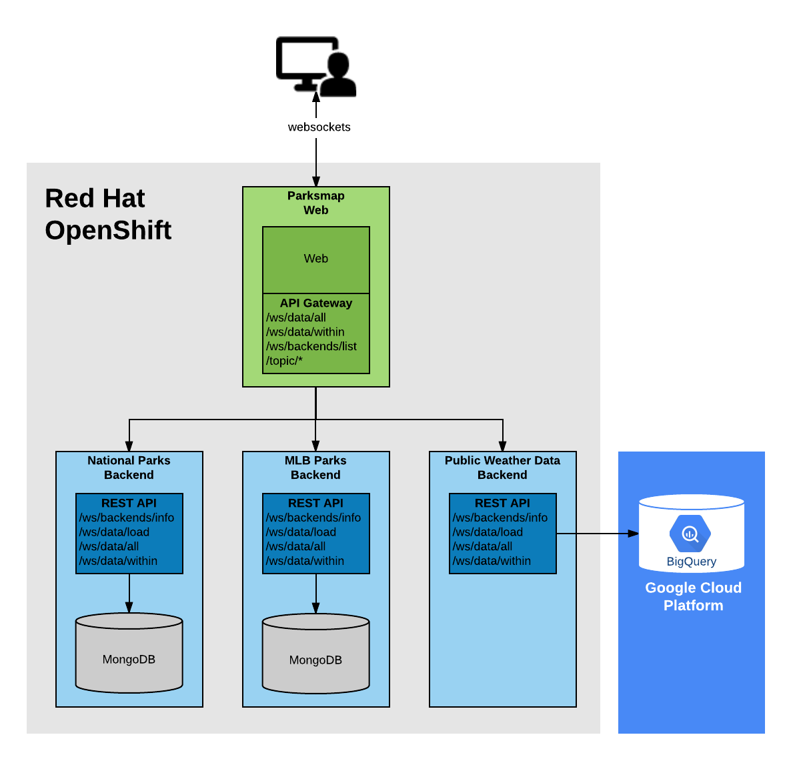

This lab introduces you to the architecture of the Hello application used throughout this workshop, to get a better understanding of the things you'll be doing from a support perspective. 

Hello-app is a simple monolithic app that exposes some cluster statistics through a REST API. It is used by the Container Squad itself for testing the Automation Platform and the Container Platform by deploying this simple small app.

The original source code for this application is located link:https://bitbucket.swift.com/projects/AP/repos/hello[here] and the environment specific configuration is located link:https://bitbucket.swift.com/projects/AP/repos/hello-config-si[here]
