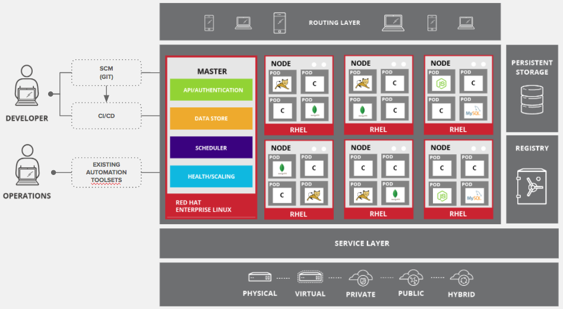

The workshop is hosted in an OpenShift environment that is running as a 
private cloud inside SWIFT. The environment consists of the following systems:

* HAProxy Load-Balancer
* Master nodes
* Infrastructure nodes
* Application nodes
* VMware DataStore

The infrastructure node is providing several services:

* The OpenShift container registry
* The OpenShift router
* The OpenShift Central Logging components
* The OpenShift Monitoring components
* This lab manual

You will have your own user account in the OpenShift environment. Your user name is **{{username}}**.

You will also have a dedicated project namespace to work in. The name of your project namespace is **{{project_namespace}}**.
