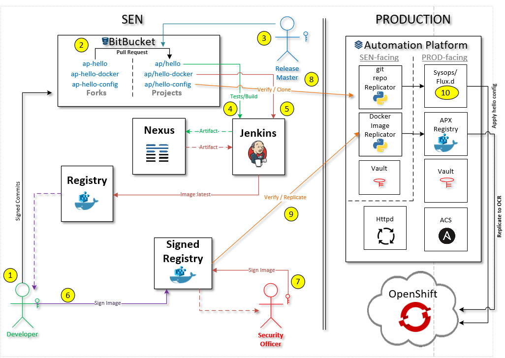

== About
This is a sample web application created to be deployed on OpenShift Container Platform (OCP) and this application will in turn be used for validating OCP cluster features such as data persistence and L4 ingres.

Find the end to end flow of the hello app below.

== Step 1
Developer makes changes and pushes to his change to personal BitBucket fork.

== Step 2
Creates a pull request from his personal fork to project repository.

== Step 3
Teammates will review the change and approve the PR. At-least 3 approvals are needed to merge the PR.

After the PR is merged, Release master is going to and ensure git-repo-replicator-config is pointing to to the right source repository.

== Step 4
New commit from the above step will create a new commit on project repo that in turn will trigger Jenkins build and stage the build artifact into nexus.

== Step 5
Follow up job will be triggered and new image will be built based of hello-docker repo, and new image will be built and if all the automated integration tests pass, the image will be pushed to internal registry.

== Step 6
Developer signs the image and pushes to signed-registry.

== Step 7
Security officer signs the image and updates the image in signed-registry, Also updates the hello-config repo as needed.

== Step 8
git-repo-replicator will replicate git config and image whitelist to target environment.

== Step 9
docker-image-replicator will identify the updated whitelist automatically and replicate images to destination apx-registry and OCR as configured.

== Step 10
Operations login using sysops user on target environment's APX host and applies the kubernetees config to the OCP cluster. This step will be automated later on using flux from weaveworks.

== See Also
* link:https://wiki.swift.com/Automation_Platform/Hello_E2E_Flow[Wiki - Hello E2E Flow]
* link:https://wiki.swift.com/Platform_Services_Organization/Container_Squad/Container_Pipeline/Example_Application_Flows[Wiki - Example Application Flows]
